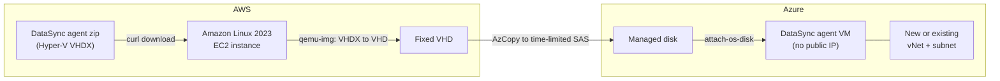
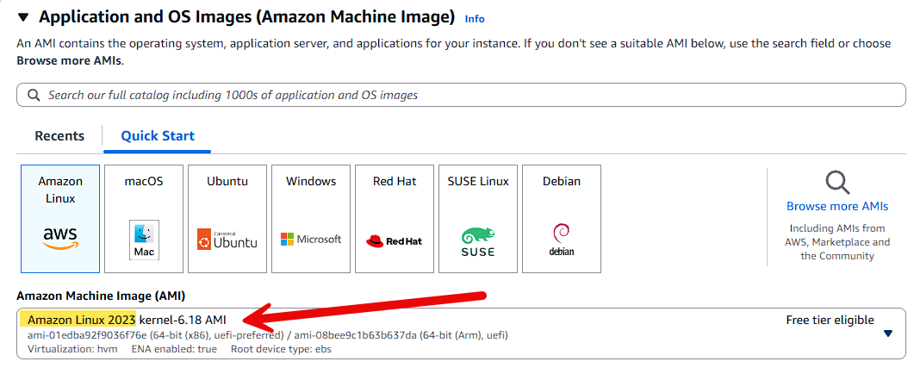
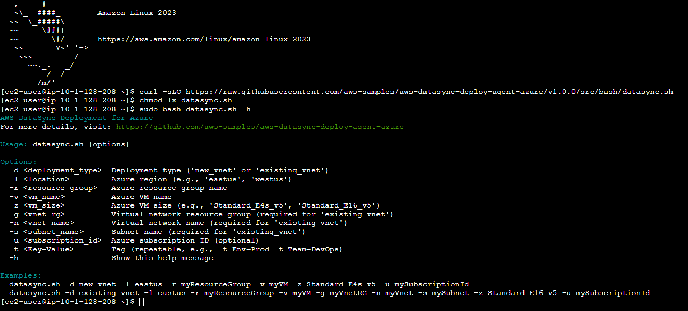
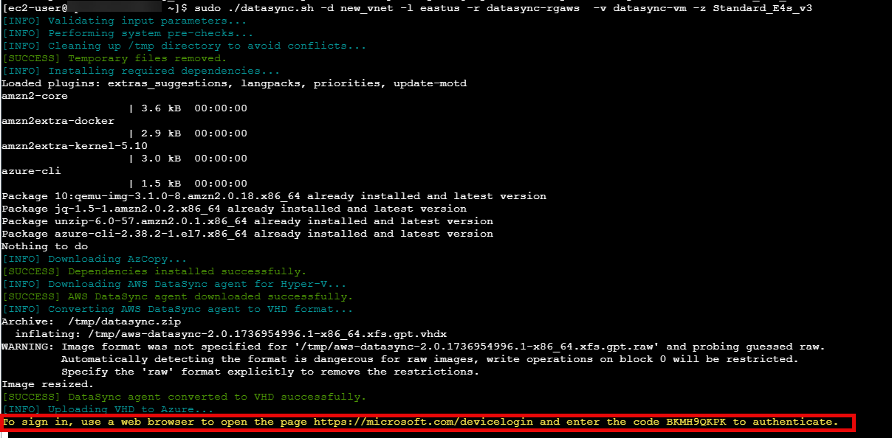
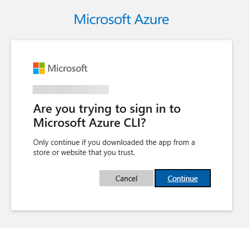
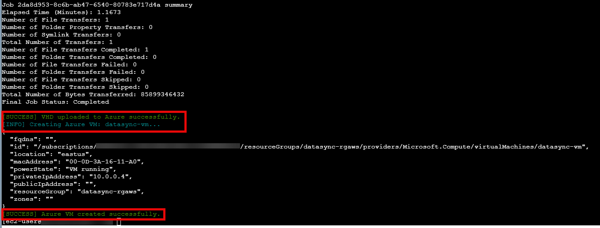

# AWS DataSync Deployment for Azure

This repository contains a script designed to convert the DataSync Agent VHDX to VHD on Amazon Linux 2023 (AL2023), upload the generated disk to Azure and create an Azure Virtual Machine. The script will create the DataSync Virtual Machine in a new Azure vNet and Subnet or it can also use an existing Azure vNET and Subnet. During deployment, you have the option to specify your Azure Subscription ID, which allows the script to deploy the appliance within a specific Azure subscription context. Please review the Parameters section for all deployment options, including how to specify the Subscription ID and other configuration settings.

## Blogs
For more details on migrating Azure Blob Storage to Amazon S3 using AWS DataSync, see the following blog post:

[Migrating Azure Blob Storage to Amazon S3 Using AWS DataSync](https://aws.amazon.com/blogs/storage/migrating-azure-blob-storage-to-amazon-s3-using-aws-datasync/)

For information on moving data from Azure Files SMB shares to AWS using AWS DataSync, check out this blog post:

[How to Move Data from Azure Files SMB Shares to AWS Using AWS DataSync](https://aws.amazon.com/blogs/storage/how-to-move-data-from-azure-files-smb-shares-to-aws-using-aws-datasync/)

## Getting Started

To start the deployment, make sure you have met all the necessary prerequisites and are familiar with the configuration parameters needed for successful execution.

**It is recommended to log in to your Azure account before running the script.** During the script execution, you'll be prompted to enter the authorization code provided in the Azure console to grant the script access to your Azure resources.

## Architecture

The deployment runs from an Amazon Linux 2023 EC2 instance and produces a DataSync agent VM in Azure:


```mermaid
flowchart LR
    subgraph AWS["AWS"]
        EC2["Amazon Linux 2023<br/>EC2 instance"]
        CF["DataSync agent zip<br/>(Hyper-V VHDX)"]
        CF -->|"curl download"| EC2
        EC2 -->|"qemu-img: VHDX to VHD"| VHD["Fixed VHD"]
    end
    subgraph Azure["Azure"]
        DISK["Managed disk"]
        VM["DataSync agent VM<br/>(no public IP)"]
        DISK -->|"attach-os-disk"| VM
        VM --- VNET["New or existing<br/>vNet + subnet"]
    end
    VHD -->|"AzCopy to time-limited SAS"| DISK
```

## Deployment Steps

The deployment script automates the following steps to integrate AWS DataSync with Azure:

1. **Provide Configuration Parameters**: Customize the deployment by specifying required parameters such as deployment type, location, resource group, and VM details.
2. **Install Dependencies**: Automatically installs Azure CLI, AzCopy, and other required tools.
3. **Download and Convert DataSync Agent**: Downloads the AWS DataSync agent and converts it to a VHD format compatible with Azure.
4. **Authenticate with Azure**: Guides you through logging into Azure to manage resources securely and validates the provided Subscription ID (if specified).
5. **Create or Use Resource Group**: Ensures the specified Azure resource group exists or creates it if necessary.
6. **Upload VHD to Azure**: Renames the VHD file to match the Azure VM name and uploads it as a managed disk in Azure.
7. **Create Azure VM**: Deploys an Azure Virtual Machine using the uploaded VHD, supporting both new and existing VNET configurations.

### Prerequisites

Before running the deployment script, please ensure that you have the following and the parameters needed for Azure readily available:
- Amazon Linux 2023 instance with 200GB storage
- Azure permissions to:
  - Create/manage resource groups
  - Create/manage virtual machines
  - Create/manage virtual networks (if using new_vnet deployment)
  - Upload and manage disks

> This script has been developed to run on an Amazon Linux 2023 AMI. The EC2 instance should have at least **200GB** of disk space: the conversion holds the intermediate `.raw` and the final fixed `.vhd` (each roughly 80GB) at the same time, so ~160GB is the bare peak and leaves no headroom. The script pre-checks for at least 170GB free on the work directory and will stop early if there is not enough space. (Amazon Linux 2 reached end of life on June 30, 2026 and should no longer be used.)
>
> **Note:** the script writes its large intermediate files to `/var/tmp` by default (override with the `WORKDIR` environment variable). Do not use `/tmp`, which on Amazon Linux 2023 is a RAM-backed `tmpfs` mount that is far too small.
>
> ⚠️ **Default agent credentials.** The deployed DataSync agent VM ships with well-known default
> credentials (`admin` / `password`) on its local console. Before or immediately after deployment,
> plan to either change the password on first login **or** confirm the local console is not
> network-reachable (see the Azure NSG guidance in [Network and IAM Access](#network-and-iam-access)
> and the [Security](#security) section). Do not leave the default credentials reachable from
> untrusted networks.



**Mandatory Parameters:**
- **Deployment Type (-d)**: Choose whether you want to use a ('new_vnet' or 'existing_vnet')
- **Location (-l)**: Azure region where you want to deploy your resources (e.g., 'eastus', 'westus')
- **Resource Group (-r)**: Azure Resource Group name (e.g. aws-datasync-rg)
- **Virtual Machine Name (-v)**: The  name for the Azure Virtual Machine that will host the AWS DataSync Agent (e.g. aws-datasync-vm)
- **Virtual Machine Size (-z)**: Azure VM size (e.g., 'Standard_E4s_v5', 'Standard_E16_v5')

**Optional Parameters:**
- **Subscription ID (-u)**: Azure subscription ID (optional)
- **Tag (-t)**: Azure resource tag as `Key=Value`, applied to the created VM. Repeatable — pass `-t` multiple times to add several tags (e.g. `-t Env=Prod -t Team=DevOps`).

**Additional Parameters (when -d is existing_vnet):**
- **VNET Resource Group (-g)**: Virtual network resource group (required for 'existing_vnet')
- **VNET Name (-n)**: Virtual network name (required for 'existing_vnet')
- **Subnet Name (-s)**: (required for 'existing_vnet')

When selecting the Azure Virtual Machine for the Datasync Agent, we recommend the following:
- 32 GB of RAM assigned to the VM for task executions working with **up** to 20 million files, objects, or directories.
- 64 GB of RAM assigned to the VM for task executions working with **more** than 20 million files, objects, or directories.  
- For detailed AWS DataSync agent requirements, see the [AWS DataSync Agent Requirements](https://docs.aws.amazon.com/datasync/latest/userguide/agent-requirements.html) documentation.

> **Important — the DataSync agent image is Hyper-V Generation 1 (Gen1).** You must choose a VM
> size that supports Gen1 disks. Newer size families are **Gen2-only** (e.g. the `v7` E/D-series)
> or **confidential-compute only** (e.g. `EC*`/`DC*` sizes, which require a ConfidentialVM/Gen2
> image) and will fail with a `cannot boot Hypervisor Generation '1'` or `security type` error.
> Gen1-capable families such as `Esv3`/`Esv4`/`Esv5` (e.g. `Standard_E4s_v5`) work. If your chosen
> size reports **capacity restrictions** (`SkuNotAvailable`) in your region, try another Availability
> Zone (`az vm create --zone 1|2|3`), or deploy to a different region (`-l eastus2`, `-l westus2`).
> To list Gen1-capable, unrestricted 4-vCPU sizes in a region:
> ```bash
> az vm list-skus --location <region> --resource-type virtualMachines --all \
>   --query "[?length(restrictions)==\`0\` && capabilities[?name=='HyperVGenerations' && contains(value,'V1')] && capabilities[?name=='vCPUs' && value=='4']].name" -o tsv
> ```

---
### Download the Deployment Script
For a reproducible deployment, download the script from a **release tag** (not `main`, which
changes over time). The current release is `v1.0.0`:

```
curl -sLO https://raw.githubusercontent.com/aws-samples/aws-datasync-deploy-agent-azure/v1.0.0/src/bash/datasync.sh
```

**Verify the download before running it.** Because the script is executed with `sudo` (root),
confirm its integrity against the published SHA-256 checksum for that release before making it
executable:

```
echo "b98ac5d4639b4a09e74138ec9e1411ad6c61b3ef9882be3bd12ce0c69d9e1c73  datasync.sh" | sha256sum -c -
```

The command prints `datasync.sh: OK` on success and fails loudly on any mismatch.

| Release tag | SHA-256 of `src/bash/datasync.sh` |
|-------------|-----------------------------------|
| `v1.0.0` | `b98ac5d4639b4a09e74138ec9e1411ad6c61b3ef9882be3bd12ce0c69d9e1c73` |

> **Maintainers:** cut a new release tag whenever `datasync.sh` changes, regenerate this value
> (`sha256sum src/bash/datasync.sh`), and add a row for the new tag so users can pin to a verified
> release. Downloading from `main` is not recommended because its checksum is not stable.

Once verified, make the script executable:
```
chmod +x datasync.sh
```

**Display the help menu** to see all available options:
```
sudo bash datasync.sh -h
```


### Running the Deployment Script

Once you have your parameters ready, you can initiate the deployment script using the following commands:

```
sudo bash datasync.sh -d new_vnet -l eastus -r testResourceGroup -v testVM -z Standard_E4s_v5 -u xxxxxxxx-xxxx-xxxx-xxxx-xxxxxxxxxxxx
```

Replace `xxxxxxxx-xxxx-xxxx-xxxx-xxxxxxxxxxxx` with your actual Azure subscription ID.

For existing_vnet deployment:
```
sudo bash datasync.sh -d existing_vnet -l eastus -r aws-datasync-rg -v datasync-vm -g existing-vnet-rg -n existing-vnet -s existing-subnet -z Standard_E16_v5 -u mySubscriptionId
```
Replace `mySubscriptionId` with your actual Azure subscription ID.

To apply Azure resource tags to the created VM, add one or more `-t Key=Value` flags:
```
sudo bash datasync.sh -d new_vnet -l eastus -r testResourceGroup -v testVM -z Standard_E4s_v5 -u mySubscriptionId -t Env=Prod -t Team=DevOps
```

### Subscription ID Validation

The script validates the provided Azure subscription ID to ensure it is correct. If the subscription ID is invalid, the script will log an error and exit. Retrieve the correct subscription ID using the following command in Azure CloudShell:

```
az account list --output table
```
## Azure CLI Login
You will be prompted to login to Azure and allow the script to create the Virtual Machine for the DataSync Appliance



Confirm the sign-in request for the Microsoft Azure CLI to grant the script access to your Azure resources:




## Successful deployment to Azure.



## Login Credentials
After the successful deployment of the AWS DataSync agent on the Azure Virtual Machine, you can access the agent using the following default login credentials:

Username: admin   
Password: password

Use these credentials to log into the DataSync agent and continue the setup and configuration.
**On first login you will be prompted to change the password** — set a strong, unique value when prompted.

> ⚠️ **Security: change the default password on first login.** `admin` / `password` are
> well-known default credentials. The agent prompts you to change the password the first time you
> log in — do so with a strong, unique value and do not defer it. Also do not expose the agent
> local console to untrusted or public networks — this script deliberately creates the VM
> **without a public IP** (`--public-ip-address ""`), so reach the console over the private vNet
> or through a bastion host, and restrict the subnet's network security group to only the sources
> that need access.


## Network and IAM Access

After the agent VM exists, you still need network connectivity from the agent to AWS and the
right AWS permissions to activate it. The script creates the VM **without a public IP**; the
guidance below assumes that private-by-default posture.

### Azure side — minimum NSG rules for the agent VM

| Direction | Protocol / Port | Source / Destination | Purpose |
|-----------|-----------------|----------------------|---------|
| Outbound | TCP 443 | `datasync.<region>.amazonaws.com` and the AWS DataSync agent/service endpoints | Agent activation and data transfer to AWS |
| Outbound | TCP 443 | Your S3 / storage destination endpoints | Data transfer to the destination |
| Inbound | TCP 80 | Operator subnet **only** (activation) | One-time local console activation, if activating over HTTP from the same network |
| Inbound | TCP 22 | Operator subnet / bastion **only** | Optional SSH for direct operator access |
| Inbound | Any | Internet (`0.0.0.0/0`) | **Deny by default** — do not expose the agent console or SSH to the Internet |

Notes:
- Keep **inbound from the Internet denied**. Reach the agent over the private vNet, vNet peering, or a bastion host.
- For **private activation**, use a DataSync VPC endpoint on the AWS side and allow outbound 443 to that endpoint's private IPs instead of the public service endpoint.
- Restrict inbound TCP 80/22 to the specific operator source ranges that need them; remove them entirely once activation is complete.

### AWS side — minimum IAM permissions for the activator

Activating the agent is a `datasync:CreateAgent` API call (despite the "Create" name, this is the
action that activates an already-deployed agent using its activation key). If you activate using a
broad identity such as an administrator or account owner, these permissions are already granted and
no extra setup is needed — which is why you may never have configured them explicitly. The policy
below matters when the activator uses a **least-privilege** role. It needs at least:

```json
{
  "Version": "2012-10-17",
  "Statement": [
    {
      "Effect": "Allow",
      "Action": [
        "datasync:CreateAgent",
        "datasync:DescribeAgent",
        "datasync:ListAgents"
      ],
      "Resource": "*"
    }
  ]
}
```

Scope `Resource` down from `*` to specific agent ARNs where your environment allows it — DataSync
agents have the ARN format `arn:aws:datasync:<region>:<account-id>:agent/<agent-id>`.

If you activate the agent privately through a DataSync VPC endpoint, control API access with a
**VPC endpoint policy** (DataSync supports endpoint policies that restrict which actions and
principals can use the endpoint). See
[Access management for AWS DataSync](https://docs.aws.amazon.com/datasync/latest/userguide/managing-access-overview.html)
for the identity-based policy model, agent/location/task resource ARNs, and a VPC endpoint policy
example. DataSync supports only identity-based policies (no resource-based policies).

### Logging
The script includes logging with color-coded output:

- 🔵 INFO
- 🟡 WARNING
- 🔴 ERROR
- 🟢 SUCCESS

## Clean Up

Once the deployment script has successfully executed and the AWS DataSync Agent is deployed on Azure, you can clean up your environment:

1. **Delete the EC2 conversion instance and its EBS volume.** The EC2 instance is only needed for the one-time VHDX→VHD conversion and upload, and is not required for the running agent. Terminating the instance deletes the root EBS volume only if "delete on termination" was set (the default for the root volume); any additional/attached EBS volumes must be deleted separately:
   ```bash
   aws ec2 terminate-instances --instance-ids <instance-id>
   # after termination, delete any leftover volumes that were not auto-deleted
   aws ec2 describe-volumes --filters Name=status,Values=available --query "Volumes[].VolumeId" --output text
   aws ec2 delete-volume --volume-id <volume-id>
   ```

2. **Remove the scratch files on the build instance** (only relevant if you keep the EC2 instance). The conversion leaves large intermediate images (the agent zip and the ~80 GB `.vhd`) in the work directory:
   ```bash
   rm -f "${WORKDIR:-/var/tmp}"/datasync.zip "${WORKDIR:-/var/tmp}"/azcopy.tar.gz "${WORKDIR:-/var/tmp}"/*.vhdx "${WORKDIR:-/var/tmp}"/*.raw "${WORKDIR:-/var/tmp}"/*.vhd
   ```
   (A subsequent run of the script also clears these automatically before starting.)

3. **Delete the intermediate VHD blob from Azure Storage.** This script uploads directly to a managed disk (via `az disk create --upload-type Upload`), so in the default flow there is **no** separate staging blob to remove. However, if you adapted the flow to stage the VHD in a Storage account blob first, delete that blob once the managed disk exists:
   ```bash
   az storage blob delete --account-name <storage-account> --container-name <container> --name <vm_name>.vhd --auth-mode login
   ```

4. **Optionally delete the staging Storage account** if one was created solely for this deployment:
   ```bash
   az storage account delete --name <storage-account> -g <resource_group> --yes
   ```

5. **Delete any orphaned Azure managed disks from failed attempts.** If VM creation failed (for example due to `SkuNotAvailable` capacity errors) and you re-ran the deployment, earlier uploaded disks may be left behind and will continue to incur storage charges. List and delete unattached disks:
   ```bash
   # list disks and their attachment state
   az disk list -g <resource_group> --query "[].{name:name, state:diskState, attachedTo:managedBy}" -o table
   # delete an unattached disk you no longer need
   az disk delete -n <disk_name> -g <resource_group> --yes
   ```

6. **Decide whether to retain or delete the network resources.**
   - If you used the **`new_vnet`** path, the script created a new vNet and subnet. To tear everything down (VM, disk, vNet), delete the whole resource group:
     ```bash
     az group delete --name <resource_group> --yes --no-wait
     ```
   - If you used the **`existing_vnet`** path, **do not** delete the resource group or vNet — those pre-existed and may host other resources. Delete only the VM and its managed disk:
     ```bash
     az vm delete -g <resource_group> -n <vm_name> --yes
     az disk delete -g <resource_group> -n <disk_name> --yes
     ```

Thank you for using the AWS DataSync Deployment for Azure repository. We hope this tool proves valuable in streamlining your data synchronization between AWS and Azure environments.

## Security

When deploying this sample, keep the following in mind:

- **Change the default agent credentials** (`admin` / `password`) on first login. See the
  [Login Credentials](#login-credentials) section.
- **Restrict console network access.** The VM is created without a public IP; keep it that
  way and limit access to the agent console via network security groups and a private path
  (vNet peering / bastion).
- **Delete the build EC2 instance** once deployment completes (see [Clean Up](#clean-up)). It
  is only needed for the one-time VHDX→VHD conversion.
- **Use least-privilege Azure permissions** scoped to the resource group, disk, network, and
  VM operations this script performs.
- **Review the script before running it as root.**

For reporting security issues, see CONTRIBUTING for more information.

## License

This library is licensed under the MIT-0 License. See the LICENSE file.

## About

VHDX to VHD Conversion Tool for AWS DataSync
