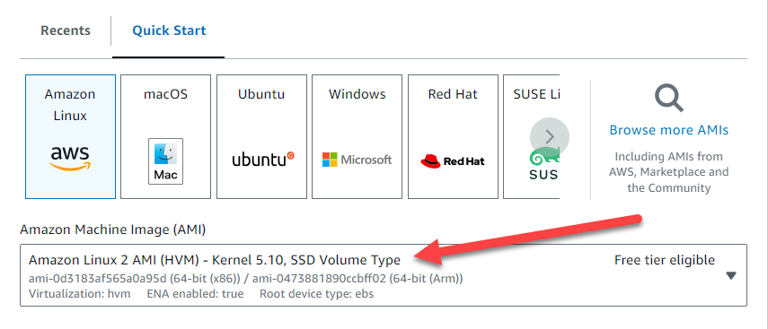

# AWS DataSync Deployment for Azure

This repository contains a script designed to convert the DataSync Agent VHDX to VHD on Amazon Linux 2 (AL2), and upload the generated disk to Azure and create an Azure Virtual Machine. The script will create the DataSync Virtual Machine in a new Azure vNet and Subnet or it can also use an existing Azure vNET and Subnet. Please review the Parameters section for deployment options.

## Blogs
For more details on migrating Azure Blob Storage to Amazon S3 using AWS DataSync, see the following blog post:

[Migrating Azure Blob Storage to Amazon S3 Using AWS DataSync](https://aws.amazon.com/blogs/storage/migrating-azure-blob-storage-to-amazon-s3-using-aws-datasync/)

For information on moving data from Azure Files SMB shares to AWS using AWS DataSync, check out this blog post:

[How to Move Data from Azure Files SMB Shares to AWS Using AWS DataSync](https://aws.amazon.com/blogs/storage/how-to-move-data-from-azure-files-smb-shares-to-aws-using-aws-datasync/)

## Getting Started

To start the deployment, make sure you have met all the necessary prerequisites and are familiar with the configuration parameters needed for successful execution.

It's recommended to log in to your Azure account before running the script. During the script execution, you'll be prompted to enter the authorization code provided in the Azure console to grant the script access to your Azure resources.

## Deployment Steps

The deployment script automates several steps to ensure a smooth integration between AWS DataSync and Azure services. Here's a breakdown of the deployment process:

1. Provide Configuration Parameters: Before executing the script, open it in your preferred editor and provide the necessary configuration parameters. These parameters will be used to customize the deployment according to your requirements.
2. Install Azure CLI and AzCopy: As a part of the setup process, the script will **automatically** download and install the Azure Command-Line Interface (CLI) and AzCopy tools. These tools are essential for managing and transferring data within the Azure environment.
3. Download AWS DataSync Agent for Hyper-V: The script will download the AWS DataSync Agent specifically designed for Hyper-V environment.
4. Convert VHDX to VHD: Once the AWS DataSync Agent is downloaded, the script will take care of converting the Virtual Hard Disk (VHDX) file to the compatible Hyper-V Disk (HVD) format for Azure
5. Azure Authentication: To access and manage your Azure resources, the script will guide you through the authentication process, ensuring secure access to your Azure account.
6. Create Resource Group: The deployment script will automatically create or use an existing Azure Resource Group. This Resource Group will serve as the container for your deployed resources.
7. Upload VHD as Managed Disk: The script will upload the converted VHD file as a managed disk within the specified Resource Group. This disk will contain the AWS DataSync Agent.
8. Create Virtual Machine: Leveraging the uploaded managed disk, the script will create an Azure Virtual Machine in either a new VNET or an existing VNET and subnet. 

### Prerequisites

Before running the deployment script, please ensure that you have the following and the parameters needed for Azure readily available:
- Amazon Linux 2 instance with 160GB storage
- Azure permissions to:
  - Create/manage resource groups
  - Create/manage virtual machines
  - Create/manage virtual networks (if using new_vnet deployment)
  - Upload and manage disks

> This script has been developed to run on an Amazon Linux 2 AMI and the EC2 instance should have at least 160GB of disk space for the conversion process



**Mandatory Parameters:**
- **Deployment Type (-d)**: Choose whether you want to use a ('new_vnet' or 'existing_vnet')
- **Location (-l)**: Azure region where you want to deploy your resources (e.g., 'eastus', 'westus')
- **Resource Group (-r)**: Azure Resource Group name (e.g. aws-datasync-rg)
- **Virtual Machine Name (-v)**: The  name for the Azure Virtual Machine that will host the AWS DataSync Agent (e.g. aws-datasync-vm)
- **Virtual Machine Size (-z)**: Azure VM size (e.g., 'Standard_E4s_v3', 'Standard_E16_v5')

**Additional Parameters (when -d is existing_vnet):**
- **VNET Resource Group (-g)**: Virtual network resource group (required for 'existing_vnet')
- **VNET Name (-n)**: Virtual network name (required for 'existing_vnet')
- **Subnet Name (-s)**: (required for 'existing_vnet')

**Display Help Menu**
- **Show help message (-h)**
```
sudo bash datasync.sh -h
```


When selecting the Azure Virtual Machine for the Datasync Agent, we recommend the following:
- 32 GB of RAM assigned to the VM for task executions working with **up** to 20 million files, objects, or directories.
- 64 GB of RAM assigned to the VM for task executions working with **more** than 20 million files, objects, or directories.  
- For detailed AWS DataSync agent requirements, see the [AWS DataSync Agent Requirements](https://docs.aws.amazon.com/datasync/latest/userguide/agent-requirements.html) documentation.

---

### Download the Deployment Script

Run the following command to download the deployment script from the code repository:

```
curl -sLO https://raw.githubusercontent.com/aws-samples/aws-datasync-deploy-agent-azure/main/src/bash/datasync.sh
```
Make the script executable:
```
chmod +x datasync.sh
```
### Running the Deployment Script

Once you have your parameters ready, you can initiate the deployment script using the following commands:

For new_vnet deployment:
```
sudo bash datasync.sh -d new_vnet -l eastus -r myResourceGroup -v myVM -z Standard_E4s_v3
```

For existing_vnet deployment:
```
sudo bash datasync.sh -d existing_vnet -l eastus -r aws-datasync-rg -v datasync-vm -g existing-vnet-rg -n existing-vnet -s existing-subnet -z Standard_E16_v5
```

## Azure CLI Login
You will be prompted to login to Azure and allow the script to create the Virtual Machine for the DataSync Appliance


## Successful deployment to Azure.


## Login Credentials
After the successful deployment of the AWS DataSync agent on the Azure Virtual Machine, you can access the agent using the following default login credentials:

Username: admin   
Password: password

Be sure to use these credentials to log into the DataSync agent and continue the setup and configuration.


### Logging
The script includes logging with color-coded output:

- 🔵 INFO
- 🟡 WARNING
- 🔴 ERROR
- 🟢 SUCCESS

## Clean Up

Once the deployment script has successfully executed and the AWS DataSync Agent is deployed on Azure, you can clean up your environment:

1. Delete Amazon Linux EC2 Instance: The Amazon Linux EC2 instance that was used for the deployment can be safely deleted. The script will have completed its tasks, and the instance is no longer required for the ongoing operation of the integration.

Thank you for using the AWS DataSync Deployment for Azure repository. We hope this tool proves valuable in streamlining your data synchronization between AWS and Azure environments.

## Security

See CONTRIBUTING for more information.

## License

This library is licensed under the MIT-0 License. See the LICENSE file.

## About

VHDX to VHD Conversion Tool for AWS DataSync
